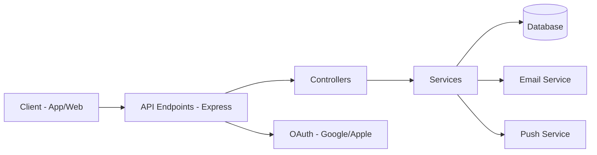
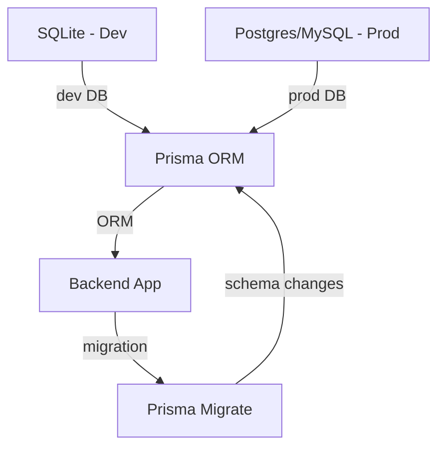

# HUXbackend – HUX Smart Ring Backend API

This is the Node.js/Express/Prisma backend API for the HUX Smart Ring ecosystem.  
It provides authentication, health data management, notifications, and more.

---

## 🛠️ Tech Stack & Main Features

- **Framework:** Node.js, Express
- **Language:** TypeScript
- **ORM:** Prisma
- **Database:** SQLite (dev), Postgres/MySQL (prod recommended)
- **Auth:** JWT, Google/Apple OAuth
- **Email:** Nodemailer (verification, password reset)
- **Push:** Expo Push Notification
- **Validation:** Zod
- **Docs:** Swagger/OpenAPI
- **Testing:** Jest, Supertest

**Main Features:**
- User registration, login, JWT auth, social login
- Email verification, password reset
- Profile management, push token registration
- Health data endpoints (planned)
- Analytics/admin endpoints (user stats, etc.)
- API documentation at `/api-docs`

---

### 🗂️ Backend Architecture Diagram



---

## 🚀 Setup, Run & Debug

```sh
# Install dependencies
npm install

# Start the backend server (dev)
npm run dev

# Run tests
npm test
```

**Debugging:**
- Use console logs and error stack traces
- Use Swagger UI at `/api-docs` to test endpoints
- For DB issues, check Prisma logs and DB file

---

## 🔗 API Overview

- **Swagger/OpenAPI docs:**
  - Start the backend and visit: `http://localhost:3000/api-docs`
- **Endpoints:**
  - `/auth/*` – Auth, registration, social login
  - `/me`, `/profile` – User info, profile management
  - `/push` – Push token registration/testing
  - `/analytics` – User/admin analytics
  - `/docs` – API docs

---

## 🗄️ Database & Environment

- **Default:** SQLite (dev, file-based, easy setup)
- **Production:** Postgres/MySQL recommended (see README for migration)
- **Config:**
  - Environment variables in `.env` (see `.env.example`)
  - Prisma schema in `prisma/schema.prisma`
- **Migrations:**
  - Use Prisma CLI for DB migrations

### 🗂️ Database/Environment Diagram



---

## 🤝 Contributing to the Backend

- Follow code style (TypeScript, ESLint, Prettier)
- Use feature branches and submit PRs
- Write tests for new endpoints (Jest, Supertest)
- Update API docs as needed
- See [README.md](./README.md) for monorepo guidelines

---

**Note:** This backend is part of a larger monorepo. For frontend, testing, and infrastructure details, always refer to the root README. 

- Full React Native bridge for all required vendor SDK APIs (see [../../manufacturer.md](../../manufacturer.md)) 