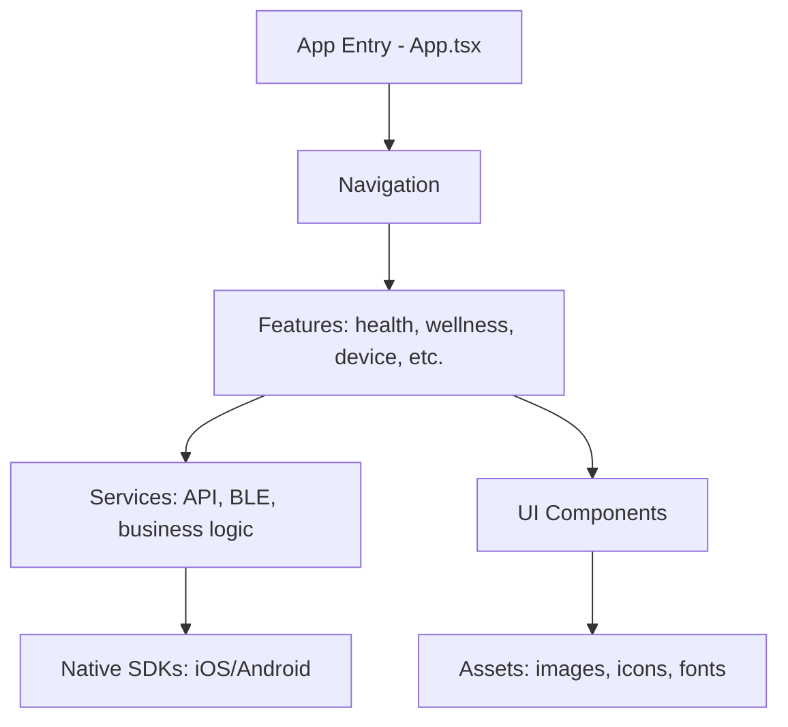
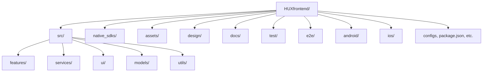

# HUXfrontend – HUX Smart Ring Mobile App

This is the React Native (Expo) mobile application for the HUX Smart Ring ecosystem.  
It supports both iOS and Android, and provides comprehensive health, wellness, and device management features.

---

## 🛠️ Tech Stack & Main Features

- **Framework:** React Native (Expo)
- **Language:** TypeScript
- **Navigation:** React Navigation
- **State Management:** React Context + Hooks
- **UI:** Custom component library, Expo Vector Icons, Lottie
- **APIs:** REST API (backend), Expo Push, OAuth (Google/Apple)
- **Native SDKs:** BLE integration, vendor SDK structure (see native_sdks/)
- **Testing:** Detox (E2E), Jest (unit)

**Main Features:**
- Health metrics: Heart rate, SpO₂, blood pressure, ECG, temperature, sleep, steps, activity, hydration, stress, etc.
- Wellness: Mood, medication, menstrual, breathing, sleep sounds, goals, achievements
- Safety: SOS, auto SOS, family sharing
- Device management: BLE pairing, firmware updates, settings
- Analytics dashboard, AI insights, notifications

---

### 🗂️ App Architecture Diagram



---

## 🚀 Setup, Run & Debug

```sh
# Install dependencies
npm install

# iOS setup (macOS only)
cd ios && pod install && cd ..

# Start Metro bundler
npm start

# Run on Android
yarn android   # or npm run android

# Run on iOS (macOS only)
yarn ios       # or npm run ios
```

**Debugging:**
- Use Expo/Metro logs for JS errors
- Use Chrome/Flipper for React Native debugging
- For native issues, use Xcode (iOS) or Android Studio (Android)

---

## 📁 Folder Structure

```
HUXfrontend/
├── src/
│   ├── features/           # Feature modules (health, wellness, device, etc.)
│   ├── services/           # Business logic, API, BLE
│   ├── ui/                 # Reusable UI components, theme
│   ├── models/             # Data models and types
│   └── utils/              # Utility functions
├── native_sdks/            # Vendor/native SDKs (ios/, android/, docs/)
├── assets/                 # Images, icons, fonts
├── design/                 # Design system files
├── docs/                   # Project documentation
├── test/                   # Test files
├── e2e/                    # Detox E2E tests
├── android/                # Android native project
├── ios/                    # iOS native project
└── ... (configs, package.json, etc.)
```

### 🗂️ Folder Structure Diagram



---

## 📱 Native (iOS/Android) Notes

- **Native SDKs:** Place vendor SDKs in `native_sdks/ios/` and `native_sdks/android/`.
- **iOS:**
  - Requires Xcode and CocoaPods
  - Run `cd ios && pod install` after adding native modules
  - Debug native code in Xcode
- **Android:**
  - Requires Android Studio
  - Place .aar files in `native_sdks/android/` and link as needed
  - Debug native code in Android Studio
- **BLE/Device:**
  - BLE integration is scaffolded; see `src/services/BleService.ts` and native_sdks/
  - For vendor SDK integration status, see [../../manufacturer.md](../../manufacturer.md)

---

## 🤝 Contributing to the Frontend

- Follow code style (TypeScript, ESLint, Prettier)
- Use feature branches and submit PRs
- Write tests for new features (Jest, Detox)
- Update documentation as needed
- See [README.md](./README.md) for monorepo guidelines

---

**Note:** For backend, testing, and infrastructure details, always refer to the root README. 