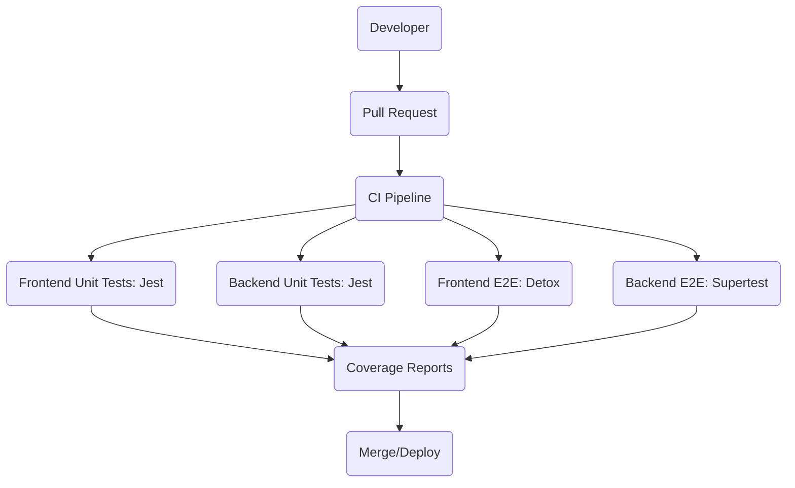
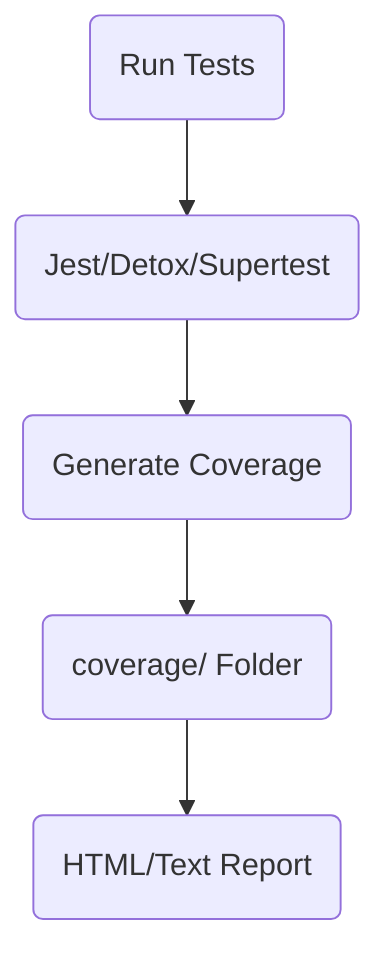

# HUXtesting – HUX Smart Ring Testing Guide

This document covers E2E, unit, and integration testing for the HUX Smart Ring project.

---

## 🧪 What is Tested?

- **Frontend:**
  - E2E tests (Detox): Auth, registration, social login, navigation, widgets, etc.
  - Unit tests (Jest): UI components, services, business logic
- **Backend:**
  - E2E tests (Jest + Supertest): Auth, protected endpoints, admin, analytics
  - Unit tests (Jest): Services, validation, utils
- **Integration:**
  - API integration (frontend ↔ backend)
  - BLE/device integration (planned)

### 🗂️ Testing Pipeline Diagram



---

## 🚀 How to Run Tests

### Frontend
```sh
# E2E tests (Detox)
cd HUXfrontend
detox test

# Unit tests (Jest)
cd HUXfrontend
npm test
```

### Backend
```sh
# All backend tests
cd HUXbackend
npm test
```

---

## 📝 How to Write New Tests

- **Frontend:**
  - Add unit tests in `HUXfrontend/__tests__/` or alongside components/services
  - Add E2E tests in `HUXfrontend/e2e/`
  - Use Jest for unit, Detox for E2E
- **Backend:**
  - Add tests in `HUXbackend/tests/`
  - Use Jest for unit/E2E, Supertest for API
- **General:**
  - Mock external dependencies as needed
  - Follow existing test patterns for structure

---

## 📊 Test Coverage Reports

- **Frontend:**
  - Run `npm test -- --coverage` in `HUXfrontend` for coverage summary
  - Coverage reports output to `coverage/` folder
- **Backend:**
  - Run `npm test -- --coverage` in `HUXbackend` for coverage summary
  - Coverage reports output to `coverage/` folder

### 🗂️ Coverage/Reporting Flow



---

## 🤝 Contributing to Testing

- Write tests for all new features and bugfixes
- Keep E2E and unit tests up to date
- Review and improve test coverage regularly
- See [README.md](./README.md) for monorepo guidelines

---

**Note:** For backend, frontend, and infrastructure details, always refer to the root README. 